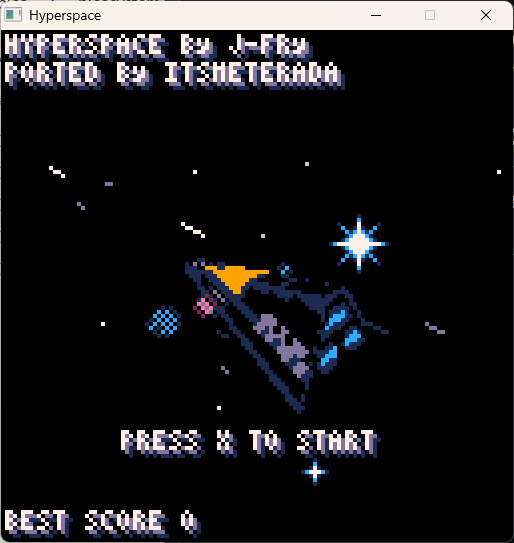

# Hyperspace for PicoSystem

[日本語版 README](README_ja.md)

A port of the PICO-8 game "Hyperspace" by J-Fry to the PicoSystem handheld console.



## Overview

Hyperspace is a 3D space shooter game originally created for PICO-8. This port brings the full game experience to the PicoSystem, a tiny handheld gaming device based on the RP2040 microcontroller.

### Features

- Full 3D software rasterization with texture mapping
- Fixed-point arithmetic for optimal performance on RP2040
- 4 enemy types: asteroids, small ships, medium ships, and boss
- Barrel roll maneuver for dodging
- Auto-fire and manual fire modes
- Persistent high score

## Building

### Prerequisites

- [Pico SDK](https://github.com/raspberrypi/pico-sdk) (v1.5.0 or later)
- [Pico Extras](https://github.com/raspberrypi/pico-extras)
- CMake 3.12 or later
- ARM GCC toolchain

### Environment Setup

```bash
export PICO_SDK_PATH=/path/to/pico-sdk
export PICO_EXTRAS_PATH=/path/to/pico-extras
```

### Build Steps

```bash
mkdir build
cd build
cmake ..
make -j$(nproc)
```

The resulting `hyperspace.uf2` file can be copied to the PicoSystem in bootloader mode.

## Controls

| Button | Action |
|--------|--------|
| D-Pad | Move ship |
| A | Fire laser |
| X | Barrel roll |

## Technical Details

### Fixed-Point Arithmetic

The original PICO-8 game uses floating-point numbers, but the RP2040 lacks a hardware FPU. This port converts all floating-point operations to Q16.16 fixed-point arithmetic using [libfixmath](https://github.com/PetteriAimworthy/libfixmath).

Key conversions:
- `float` → `fix16_t` (32-bit signed fixed-point)
- `sin()/cos()` → `fix16_sin()/fix16_cos()` (radians-based)
- `sqrt()` → `fix16_sqrt()`
- Multiplication: `a * b` → `fix16_mul(a, b)`
- Division: `a / b` → `fix16_div(a, b)`

The `FIXMATH_NO_OVERFLOW` flag is enabled for better performance, as overflow checking is unnecessary for the game's value ranges.

### 3D Rendering Pipeline

1. **Mesh Loading**: Meshes are decoded from embedded map memory (extracted from PICO-8 cartridge)
2. **Matrix Transformations**: 3x4 matrices handle rotation and translation
3. **Projection**: Perspective projection with configurable FOV
4. **Triangle Rasterization**: Scanline-based with barycentric interpolation
5. **Texture Mapping**: UV coordinates with perspective correction
6. **Lighting**: Per-triangle lighting with dithering for smooth gradients

### Memory Layout

| Section | Size | Description |
|---------|------|-------------|
| Text | ~90KB | Code |
| BSS | ~160KB | Runtime data |
| Spritesheet | 16KB | 128x128 4-bit pixels |
| Map Memory | 4KB | Mesh definitions |
| Screen Buffer | 14.4KB | 120x120 8-bit pixels |

Total RAM usage is approximately 160KB out of the RP2040's 264KB.

### Screen Resolution

- PicoSystem native: 240x240 pixels
- Game resolution: 120x120 pixels (PIXEL_DOUBLE mode)
- Original PICO-8: 128x128 pixels

The slight resolution reduction (128→120) was made to fit PicoSystem's pixel doubling mode while maintaining aspect ratio.

### Color Palette

The game uses the PICO-8 16-color palette, converted to PicoSystem's 16-bit color format (RGBA4444):

```c
#define PS_RGB(r, g, b) ((((r) >> 4) & 0xf) | (0xf << 4) | ((((b) >> 4) & 0xf) << 8) | ((((g) >> 4) & 0xf) << 12))
```

### Data Extraction

The sprite and map data are extracted from the original PICO-8 `.p8` cartridge file:

- `__gfx__` section → `hyperspace_spritesheet[128][128]`
- `__map__` section → `hyperspace_map[0x1000]`

The `convert_p8.py` script automates this conversion.

## Project Structure

```
picosystem_hyperspace/
├── main.c                 # Main game code (ported from SDL2/PICO-8)
├── hyperspace_data.h      # Embedded sprite and map data
├── convert_p8.py          # PICO-8 data extraction script
├── CMakeLists.txt         # Build configuration
├── picosystem_hardware/   # PicoSystem HAL
│   ├── picosystem_hardware.c
│   ├── picosystem_hardware.h
│   └── ...
└── libfixmath/            # Fixed-point math library
    ├── fix16.c
    ├── fix16.h
    ├── fix16_trig.c
    └── ...
```

## Related Projects

- [Hyperspace SDL2](https://github.com/itsmeterada/hyperspace) - SDL2 port for desktop platforms (Windows, macOS, Linux)

## Credits

- **Original Game**: [Hyperspace](https://www.lexaloffle.com/bbs/?tid=41663) by J-Fry (PICO-8)
- **SDL2 Port**: [itsmeterada](https://github.com/itsmeterada/hyperspace)
- **PicoSystem Port**: itsmeterada
- **libfixmath**: [PetteriAimworthy/libfixmath](https://github.com/PetteriAimworthy/libfixmath)

## License

This port is provided for educational and personal use. Please respect the original author's rights.
