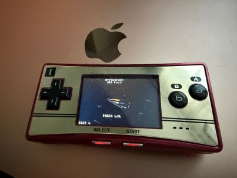

# Hyperspace - GBA Port



A port of Hyperspace to the Game Boy Advance.

## Original Game

- **Original**: [Hyperspace by J-Fry](https://www.lexaloffle.com/bbs/?tid=51336) for PICO-8
- **PicoSystem port**: itsmeterada
- **GBA port**: itsmeterada

Many optimizations developed for this GBA port have been backported to the PicoSystem version.

## Features

- Full 3D graphics with textured polygons
- Smooth gameplay on real GBA hardware
- High score saving via SRAM
- BG2 affine scaling (160x128 → 240x160 fullscreen)
- DMA-accelerated screen clearing

## Building

### Requirements

- [devkitPro](https://devkitpro.org/) with devkitARM
- GBA development libraries (libgba)

### Build Instructions

```bash
# Set environment variable
export DEVKITARM=/path/to/devkitARM

# Build
make

# Clean
make clean
```

The output ROM will be `hyperspace.gba`.

## Controls

| Button | Action |
|--------|--------|
| D-Pad | Move ship |
| A | Fire laser |
| B | Fire laser |
| START | Start game / Pause |

## Technical Details

### Display

- **Video Mode**: Mode 5 (160x128, 15-bit RGB555, double buffered)
- **Fullscreen Scaling**: BG2 affine transformation scales the framebuffer to 240x160
  - PA = 171 (160/240 in 8.8 fixed point)
  - PD = 205 (128/160 in 8.8 fixed point)
- **Double Buffering**:
  - Page 1: 0x06000000
  - Page 2: 0x0600A000
  - Flip during VBlank to prevent tearing

### Memory Layout

| Region | Size | Usage |
|--------|------|-------|
| ROM | - | Spritesheet data (const), code |
| EWRAM | 256KB | Large arrays (trails, enemies, backgrounds, cart_data) |
| IWRAM | 32KB | Hot code paths, dither pattern |
| SRAM | 32KB | High score persistence |

The `EWRAM_DATA` attribute is used to place large arrays in EWRAM to avoid IWRAM overflow:
```c
#define EWRAM_DATA __attribute__((section(".ewram")))
EWRAM_DATA static Trail trails[MAX_TRAILS];
```

### Fixed-Point Math

All 3D calculations use Q16.16 fixed-point arithmetic:
- `fix16_t` = 32-bit signed integer with 16 fractional bits
- Multiplication: `(a * b) >> 16`
- Division: `(a << 16) / b`

Lookup tables for trigonometry (256 entries each):
```c
static const s16 sin_lut[256];  // Pre-calculated sin values
```

### PICO-8 Compatibility

PICO-8's sin function is inverted compared to standard math libraries:
- PICO-8: `sin(0.25) = -1` (quarter turn = down)
- Standard: `sin(π/2) = 1`

This is handled by using standard sin in the GBA port and adjusting rotation matrices accordingly.

## Optimizations

The GBA port employs extensive optimizations to achieve smooth 3D rendering on the ARM7TDMI (16.78 MHz):

| Optimization | Speedup | Description |
|--------------|---------|-------------|
| Reciprocal LUT | ~1.5-2x | Eliminates expensive divisions in rasterizer |
| IWRAM + ARM mode | ~1.3x | Hot functions in fast memory with 32-bit instructions |
| ARM assembly | ~2x | Hand-tuned inner loops for scanline rendering |
| Early culling | Variable | Skip invisible and tiny triangles |
| DMA transfers | ~3x | Hardware-accelerated screen clearing |

### 1. DMA Screen Clearing

Screen clearing uses DMA3 with fixed source address for fast fill:
```c
static inline void DMAFastCopy(void* source, void* dest, u32 count, u32 mode) {
    REG_DMA3SAD = (u32)source;
    REG_DMA3DAD = (u32)dest;
    REG_DMA3CNT = count | mode;
}

// Clear with DMA (fixed source = fill mode)
DMAFastCopy(&clear_color, vram_buffer, SCREEN_WIDTH * SCREEN_HEIGHT,
            DMA_SRC_FIXED | DMA_DST_INC | DMA_16BIT | DMA_ENABLE);
```

### 2. Scanline-Based Rasterizer

Instead of per-pixel division for texture coordinates, the rasterizer uses scanline interpolation with reciprocal LUT:
```c
// Calculate gradients once per scanline using fast reciprocal LUT
fix16_t inv_span = fast_recip(span);  // LUT lookup instead of division
fix16_t du_dx = fix16_mul(u_right - u_left, inv_span);

// Interpolate across scanline (no division in inner loop)
for (int x = xl; x <= xr; x++) {
    row[x] = palette_map[SGET_FAST(u >> 16, v >> 16)];
    u += du_dx;
    v += dv_dx;
}
```

### 3. ARM Assembly Optimizations

Critical inner loops are written in hand-tuned ARM assembly (`raster_arm.s`), placed in IWRAM for fastest execution (~12 cycles per pixel):

**Fixed-point multiply (`fix16_mul_arm`):**
```asm
fix16_mul_arm:
    smull   r2, r1, r0, r1      @ 64-bit result in r1:r2
    mov     r0, r2, lsr #16     @ grab middle 32 bits
    orr     r0, r0, r1, lsl #16
    bx      lr
```

**Scanline renderer (`render_scanline_arm`):**
- Keeps UV coordinates and increments in registers
- Unrolled version processes 4 pixels at a time
- Uses numeric local labels (1:, 4:, 9:) in classic hand-assembly style
- Uses `ldrb`/`ldrh`/`strh` for texture fetch and pixel write

```asm
1:  @ --- pixel loop ---
    mov     r12, r3, asr #16    @ tu = u >> 16
    add     r12, r12, r9        @ + offset
    mov     lr, r4, asr #16     @ tv = v >> 16
    add     lr, lr, r10         @ + offset
    add     r12, r12, lr, lsl #7  @ tex is 128 wide
    ldrb    r12, [r7, r12]      @ fetch texel
    mov     r12, r12, lsl #1    @ *2 for u16 lookup
    ldrh    r12, [r8, r12]      @ palette lookup
    strh    r12, [r0], #2       @ store & advance
    add     r3, r3, r5          @ u += dudx
    add     r4, r4, r6          @ v += dvdx
    subs    r11, r11, #1
    bgt     1b
```

**Fast memset (`fast_memset16_arm`):**
- Uses STM to write 32 bytes per iteration
- 8 registers filled with duplicated 16-bit pattern

### 4. Inlined Pixel Operations

Pixel operations are implemented as macros to eliminate function call overhead:
```c
#define SGET_FAST(x, y) (hyperspace_spritesheet[y][x])
#define VRAM_PSET(x, y, c) do { \
    if ((unsigned)(x) < SCREEN_WIDTH && (unsigned)(y) < SCREEN_HEIGHT) \
        vram_buffer[(y) * SCREEN_WIDTH + (x)] = (c); \
} while(0)
```

### 5. Direct VRAM Rendering

Rendering directly to VRAM pages eliminates the need for a separate screen buffer and memcpy:
```c
static volatile u16* vram_buffer;  // Points to back buffer
vram_buffer = current_page ? VRAM_PAGE1 : VRAM_PAGE2;
```

### 6. Optimized Square Root

Fixed-point square root uses integer sqrt for the initial estimate:
```c
static inline u32 isqrt(u32 n) {
    u32 x = n, y = (x + 1) >> 1;
    while (y < x) { x = y; y = (x + n / x) >> 1; }
    return x;
}

static inline fix16_t fix16_sqrt(fix16_t x) {
    if (x <= 0) return 0;
    u32 root = isqrt((u32)x << 8);
    return (fix16_t)(root << 4);
}
```

### 7. Insertion Sort for Triangles

Triangle depth sorting uses insertion sort instead of qsort (faster for small arrays):
```c
static void sort_tris(Triangle* tris, int num, Vec3* projs) {
    for (int i = 1; i < num; i++) {
        Triangle temp = tris[i];
        int j = i - 1;
        while (j >= 0 && tris[j].z > temp.z) {
            tris[j + 1] = tris[j];
            j--;
        }
        tris[j + 1] = temp;
    }
}
```

### 8. Early Culling

Triangles are culled early to avoid unnecessary processing:
```c
// Skip if all vertices behind camera
if (v0->z <= 0 && v1->z <= 0 && v2->z <= 0) return;

// Skip if completely off-screen
if (max_x < 0 || min_x >= F16(SCREEN_WIDTH)) return;
if (max_y < 0 || min_y >= F16(SCREEN_HEIGHT)) return;

// Skip tiny triangles (< 1 pixel)
if (max_x - min_x < fix16_one && max_y - min_y < fix16_one) return;
```

### 8.1 Reciprocal LUT for Division Elimination

Division is expensive on ARM7TDMI (~50+ cycles). A 513-entry lookup table provides fast reciprocal calculation for the rasterizer's per-scanline divisions:

```c
// LUT: recip_lut[i] = 65536 / i (1/i in 16.16 fixed point)
static const u32 recip_lut[513] = {
    0xFFFFFFFF, // 0: unused
    0x10000, 0x8000, 0x5555, 0x4000, ...  // 1/1, 1/2, 1/3, 1/4, ...
};

IWRAM_CODE static inline fix16_t fast_recip(fix16_t x) {
    if (x <= 0) return 0;
    if (x < fix16_one) return fix16_div(fix16_one, x);  // Fallback for < 1.0
    int ix = x >> 16;
    if (ix > 511) return recip_lut[512];
    // Linear interpolation for fractional accuracy
    u32 base = recip_lut[ix];
    u32 next = recip_lut[ix + 1];
    int frac = (x >> 8) & 0xFF;
    return base - (((base - next) * frac) >> 8);
}
```

**Performance impact**: Eliminates ~10-50 divisions per triangle, replacing each 50+ cycle division with a ~5 cycle LUT lookup.

### 8.2 IWRAM Placement for Hot Functions

Critical functions are placed in IWRAM (32-bit, zero wait state) using `IWRAM_CODE`:

```c
IWRAM_CODE __attribute__((target("arm")))
static void transform_pos(Vec3* proj, const Mat34* mat, const Vec3* pos);

IWRAM_CODE __attribute__((target("arm")))
static void rasterize_flat_tri(...);

IWRAM_CODE __attribute__((target("arm")))
static void rasterize_tri(...);

IWRAM_CODE static void mat_mul_pos(...);
IWRAM_CODE static fix16_t vec3_dot(...);
```

Functions in IWRAM with ARM mode run ~2x faster than Thumb code in ROM due to:
- 32-bit bus (vs 16-bit for ROM)
- Zero wait states (vs 2-3 for ROM)
- Full 32-bit ARM instructions (vs 16-bit Thumb)

### 9. Bitmask Modulo

Where possible, modulo operations are replaced with bitmasks:
```c
// Instead of: idx = idx % 256
idx = idx & 255;
```

### 10. Simplified Angle Wrapping

Angle wrapping uses simple comparison instead of modulo:
```c
// Instead of: angle = angle % TWO_PI
if (angle > FIX_TWO_PI) angle -= FIX_TWO_PI;
if (angle < 0) angle += FIX_TWO_PI;
```

## Optimizations Backported to PicoSystem

The following optimizations were developed for the GBA port and backported to the PicoSystem version:

| Optimization | Description |
|--------------|-------------|
| Insertion Sort | Faster than qsort for small triangle arrays (<20 elements) |
| Scanline Gradients | Pre-compute barycentric gradients to avoid per-pixel division |
| Fast Macros | `SGET_FAST`/`PSET_FAST` bypass bounds checking in inner loops |
| Bitmask Modulo | Replace `% 2^n` with `& (2^n-1)` for power-of-2 divisors |
| Early Culling | Skip triangles behind camera or completely off-screen |

## File Structure

```
gba/
├── main_gba.c       # Main source file (complete GBA port)
├── raster_arm.s     # Hand-tuned ARM assembly (IWRAM)
├── Makefile         # devkitARM build configuration
├── hyperspace.gba   # Output ROM
└── README.md        # This file
```

## Related Projects

- [Hyperspace for PicoSystem](https://github.com/itsmeterada/picosystem_hyperspace) - Port for Pimoroni PicoSystem (RP2040, 240x240 display)
- [Hyperspace SDL2](https://github.com/itsmeterada/hyperspace) - SDL2 port for desktop platforms (Windows, macOS, Linux)
- [Hyperspace for Thumby Color](https://github.com/itsmeterada/hyperspace_thumbycolor) - Port for TinyCircuits Thumby Color (RP2350, 128x128 display)

## Technical Informations

- [ARM7TDMI instructions](/https://users.ece.utexas.edu/~mcdermot/arch/articles/ARM/arm7tdmi_instruction_set_reference.pdf)
- [mGBA - Game Boy Advance Emulator](https://mgba.io/)


## License

This port is based on the original PICO-8 game by J-Fry.
